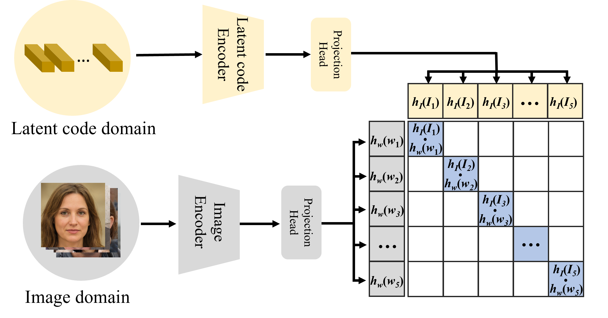
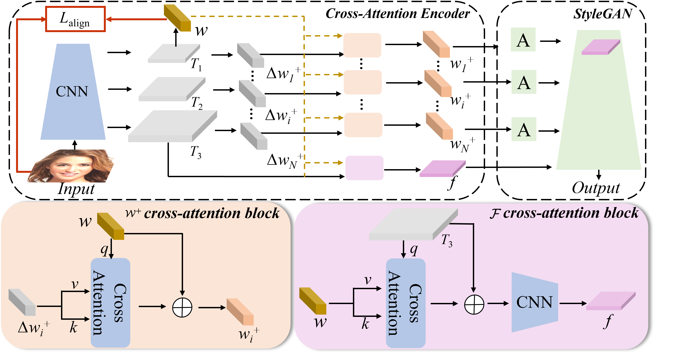

# Delving StyleGAN Inversion for Image Editing: A Foundation Latent Space Viewpoint, CVPR2023 (Official PyTorch Implementation)

<a href="https://arxiv.org/abs/2211.11448"></a>
<a href="https://opensource.org/licenses/MIT"></a>
<a href="https://www.youtube.com/watch?v=hsB9Wv50dm0"></a>  

[Project](https://kumapowerliu.github.io/CLCAE/) 

[Hongyu Liu](https://github.com/KumapowerLIU)<sup>1</sup>,
[Yibing Song](https://ybsong00.github.io/)<sup>2</sup>,
[Qifeng Chen](https://cqf.io/)<sup>1</sup>

<sup>1</sup>HKUST, <sup>2</sup> AI3 Institute, Fudan University


## :sparkles: Pipeline

### How to find the suitable foundation latent code $w$? Using Contrastive Learning!


### Obtaining the better latent code $w^+$ and $f$ based on foundation latent code $w$!



## Getting Started
### Prerequisites
- Linux or macOS
- NVIDIA GPU + CUDA CuDNN (CPU may be possible with some modifications, but is not inherently supported)
- Python 3

### Installation
- Clone this repo:
``` 
git clone https://github.com/KumapowerLIU/CLCAE.git
cd CLCAE
```
- Dependencies:  
We recommend running this repository using [Anaconda](https://docs.anaconda.com/anaconda/install/). 
All dependencies for defining the environment are provided in `environment/clcae_env.yaml`.


### Pretrained Models
Please download the pre-trained models from the following links. Each CLCAE model contains the entire architecture, including the encoder and decoder weights.
| Path | Description
| :--- | :----------
|[FFHQ_Inversion](https://drive.google.com/file/d/1gCsF8mHxjhExswCchz7UpXfe-NvAhIm9/view?usp=sharing)  | CLCAE trained with the FFHQ dataset for StyleGAN inversion.
|[Car_Inversion](https://drive.google.com/file/d/1pd8M8CZoZWx_YkJzXTSJsCk-J41dtGmt/view?usp=sharing)  | CLCAE trained with the Car dataset for StyleGAN inversion.

If you wish to use one of the pretrained models for training or inference, you may do so using the flag `--checkpoint_path_af`.

In addition, we provide various auxiliary models needed for training your own pSp model from scratch as well as pretrained models needed for computing the ID metrics reported in the paper.
| Path | Description
| :--- | :----------
|[Contrastive model and data for FFHQ](https://drive.google.com/drive/folders/19Q75nlaZ8KVdUd6C9s2y6c1cKXuB90TS?usp=sharing) | Contrastive model for FFHQ as mentioned in our paper
|[Contrastive model and data for Car](https://drive.google.com/file/d/1JzUJlBs_lRpOAU0gxDsftv4YQ1gqxXmg/view?usp=sharing) | Contrastive model for Car as mentioned in our paper
|[FFHQ StyleGAN](https://drive.google.com/file/d/1EM87UquaoQmk17Q8d5kYIAHqu0dkYqdT/view?usp=sharing) | StyleGAN model pretrained on FFHQ taken from [rosinality](https://github.com/rosinality/stylegan2-pytorch) with 1024x1024 output resolution.
|[Car StyleGAN](https://drive.google.com/file/d/1EM87UquaoQmk17Q8d5kYIAHqu0dkYqdT/view?usp=sharing) | StyleGAN model pretrained on FFHQ taken from [rosinality](https://github.com/rosinality/stylegan2-pytorch) with 512x512 output resolution.
|[IR-SE50 Model](https://drive.google.com/file/d/1KW7bjndL3QG3sxBbZxreGHigcCCpsDgn/view?usp=sharing) | Pretrained IR-SE50 model taken from [TreB1eN](https://github.com/TreB1eN/InsightFace_Pytorch) for use in our ID loss during pSp training.
|[MoCo ResNet-50](https://drive.google.com/file/d/18rLcNGdteX5LwT7sv_F7HWr12HpVEzVe/view?usp=sharing)  | Pretrained ResNet-50 model trained using MOCOv2 for computing MoCo-based similarity loss on non-facial domains. The model is taken from the [official implementation](https://github.com/facebookresearch/moco).
|[CurricularFace Backbone](https://drive.google.com/file/d/1f4IwVa2-Bn9vWLwB-bUwm53U_MlvinAj/view?usp=sharing)  | Pretrained CurricularFace model taken from [HuangYG123](https://github.com/HuangYG123/CurricularFace) for use in ID similarity metric computation.
|[MTCNN](https://drive.google.com/file/d/1tJ7ih-wbCO6zc3JhI_1ZGjmwXKKaPlja/view?usp=sharing)  | Weights for MTCNN model taken from [TreB1eN](https://github.com/TreB1eN/InsightFace_Pytorch) for use in ID similarity metric computation. (Unpack the tar.gz to extract the 3 model weights.)

By default, we assume that all auxiliary models are downloaded and saved to the directory `pretrained_models`. However, you may use your own paths by changing the necessary values in `configs/path_configs.py`. 


## Training
### Preparing your Data
- Currently, we provide support for numerous datasets and experiments (inversion and contrastive learning).
    - Refer to `configs/paths_config.py` to define the necessary data paths and model paths for training and evaluation. 
    - Refer to `configs/transforms_config.py` for the transforms defined for each dataset/experiment. 
    - Finally, refer to `configs/data_configs.py` for the source/target data paths for the train and test sets
      as well as the transforms.
- If you wish to experiment with your own dataset, you can simply make the necessary adjustments in 
    1. `data_configs.py` to define your data paths.
    2. `transforms_configs.py` to define your own data transforms.
    


### Training CLCAE (We set DDP as default setting )
The main training script can be found in `scripts/train.py`.   
Intermediate training results are saved to `opts.exp_dir`. This includes checkpoints, train outputs, and test outputs.  
Additionally, if you have tensorboard installed, you can visualize tensorboard logs in `opts.exp_dir/logs`.


#### Training the image and latent encoders during contrastive learning
For contrastive learning, you need generate the latent-image pair data with pre-trained StyleGAN model as mentioned in our paper.

For the FFHQ:
```
python3 -m torch.distributed.launch  --nproc_per_node GPU_NUM --use_env \
./scripts/train.py \
--exp_dir ./checkpoints/contrastive \
--use_norm --use_ddp --val_interval 2500 \
--save_interval 5000  --workers 8 --batch_size $batchsize_num --test_batch_size $batchsize_num
--dataset_type ffhq_encode_contrastive --train_contrastive True
```
For the Car:
```
python3 -m torch.distributed.launch  --nproc_per_node GPU_NUM --use_env \
./scripts/train.py \
--exp_dir ./checkpoints/contrastive \
--use_norm --use_ddp --val_interval 2500 \
--save_interval 5000  --workers 8 --batch_size $batchsize_num --test_batch_size $batchsize_num
--dataset_type car_encode_contrastive --train_contrastive True
``` 

#### Training the inversion model with contrastive learning
For the FFHQ:
```
python3 -m torch.distributed.launch  --nproc_per_node GPU_NUM --use_env  
./scripts/train.py    \
--exp_dir /checkpoints/ffhq_inversion  \
--use_norm --use_ddp   --val_interval 2500 --save_interval 5000  --workers 8 --batch_size 2 --test_batch_size 2 \
--lpips_lambda=0.2 --l2_lambda=1 --id_lambda=0.1 \
--feature_matching_lambda=0.01 --contrastive_lambda=0.1 --learn_in_w --output_size 1024
--dataset_type ffhq_encode_inversion --train_inversion True
```
For the Car:
```
python3 -m torch.distributed.launch  --nproc_per_node GPU_NUM --use_env  
./scripts/train.py    \
--exp_dir /checkpoints/car_inversion  \
--use_norm --use_ddp   --val_interval 2500 --save_interval 5000  --workers 8 --batch_size 2 --test_batch_size 2 \
--lpips_lambda=0.2 --l2_lambda=1 --id_lambda=0.1 \
--feature_matching_lambda=0.01 --contrastive_lambda=0.1 --learn_in_w --output_size 512
--dataset_type car_encode_inversion --train_inversion True --contrastive_model_image contrastive_car_image \ 
--contrastive_model_image contrastive_car_latent
```

## Testing
### Inference of Inversion
Having trained your model, you can use `scripts/inference_inversion.py` to apply the model on a set of images.   
For example, 
```
python3 scripts/inference_inversion.py \
--exp_dir=./results \
--checkpoint_path_af= You should wrtie the path of pretrainmodel \
--data_path= You should wrtie the path of test images folder \
--test_batch_size=1 \
--test_workers=1 \
--couple_outputs \
--resize_outputs
 
```
### Inference of Editing
You should check the `scripts/inference_edit.py` and `scripts/inference_edit_not_interface.py`

## Acknowledgments
This code borrows heavily from [pSp](https://github.com/eladrich/pixel2style2pixel), [e4e](https://github.com/omertov/encoder4editing) and [FeatureStyleEncoder](https://github.com/InterDigitalInc/FeatureStyleEncoder)


## Citation
If you find our work useful for your research, please consider citing the following papers :)

```bibtex
@InProceedings{Liu_2023_CVPR,
    author    = {Liu, Hongyu and Song, Yibing and Chen, Qifeng},
    title     = {Delving StyleGAN Inversion for Image Editing: A Foundation Latent Space Viewpoint},
    booktitle = {Proceedings of the IEEE/CVF Conference on Computer Vision and Pattern Recognition (CVPR)},
    month     = {June},
    year      = {2023},
    pages     = {10072-10082}
}
```


## License

The codes and the pretrained model in this repository are under the MIT license as specified by the LICENSE file.